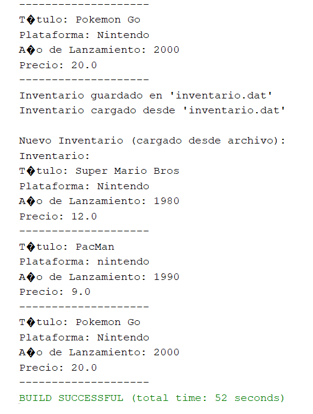

# Clase Main
```java 
package videojuego;
import java.util.Scanner;

public class Main {
    public static void main(String[] args) {
        Scanner scanner = new Scanner(System.in);
        Inventario inventario = new Inventario();

        System.out.print("¿Cuántos videojuegos desea ingresar al inventario? ");
        int cantidadVideojuegos = scanner.nextInt();
        scanner.nextLine(); 


        for (int i = 1; i <= cantidadVideojuegos; i++) {
            System.out.println("\nIngrese datos para el Videojuego #" + i + ":");

            System.out.print("Título: ");
            String titulo = scanner.nextLine();

            System.out.print("Plataforma: ");
            String plataforma = scanner.nextLine();

            System.out.print("Año de Lanzamiento: ");
            int anioLanzamiento = scanner.nextInt();
            scanner.nextLine(); 

            System.out.print("Precio: ");
            double precio = scanner.nextDouble();
            scanner.nextLine(); 


            Videojuego juego = new Videojuego(titulo, plataforma, anioLanzamiento, precio);
            inventario.agregarVideojuego(juego);
        }

        
        System.out.println("\nInventario Inicial:");
        inventario.listarInventario();
        inventario.guardarDatos("inventario.dat");
        Inventario nuevoInventario = new Inventario();
        nuevoInventario.cargarDatos("inventario.dat");
        System.out.println("\nNuevo Inventario (cargado desde archivo):");
        nuevoInventario.listarInventario();

        scanner.close(); 
    }
}
```

# Clase Videojuego
```java
package videojuego;
import java.io.Serializable;

public class Videojuego implements Serializable {
    private String titulo;
    private String plataforma;
    private int anioLanzamiento;
    private double precio;

    public Videojuego(String titulo, String plataforma, int anioLanzamiento, double precio) {
        this.titulo = titulo;
        this.plataforma = plataforma;
        this.anioLanzamiento = anioLanzamiento;
        this.precio = precio;
    }

    public String getTitulo() {
        return titulo;
    }

    public String getPlataforma() {
        return plataforma;
    }

    public int getAnioLanzamiento() {
        return anioLanzamiento;
    }

    public double getPrecio() {
        return precio;
    }

    public void setTitulo(String titulo) {
        this.titulo = titulo;
    }

    public void setPlataforma(String plataforma) {
        this.plataforma = plataforma;
    }

    public void setAnioLanzamiento(int anioLanzamiento) {
        this.anioLanzamiento = anioLanzamiento;
    }

    public void setPrecio(double precio) {
        this.precio = precio;
    }

    public void mostrarInformacion() {
        System.out.println("Título: " + titulo);
        System.out.println("Plataforma: " + plataforma);
        System.out.println("Año de Lanzamiento: " + anioLanzamiento);
        System.out.println("Precio: " + precio);
        System.out.println("--------------------");
    }
}
```
# Clase Inventario
```java
package videojuego;
import java.io.*;
import java.util.ArrayList;
import java.util.List;

public class Inventario implements Serializable {
    private List<Videojuego> videojuegos;

    public Inventario() {
        this.videojuegos = new ArrayList<>();
    }

    public void agregarVideojuego(Videojuego juego) {
        this.videojuegos.add(juego);
    }

    public void listarInventario() {
        if (videojuegos.isEmpty()) {
            System.out.println("El inventario está vacío.");
            return;
        }

        System.out.println("Inventario:");
        for (Videojuego juego : videojuegos) {
            juego.mostrarInformacion();
        }
    }

    public void buscarPorPlataforma(String plataforma) {
        boolean encontrados = false;
        for (Videojuego juego : videojuegos) {
            if (juego.getPlataforma().equalsIgnoreCase(plataforma)) {
                juego.mostrarInformacion();
                encontrados = true;
            }
        }

        if (!encontrados) {
            System.out.println("No se encontraron juegos para la plataforma '" + plataforma + "'.");
        }
    }

    public void guardarDatos(String nombreArchivo) {
        try (ObjectOutputStream oos = new ObjectOutputStream(new FileOutputStream(nombreArchivo))) {
            oos.writeObject(videojuegos);
            System.out.println("Inventario guardado en '" + nombreArchivo + "'");
        } catch (IOException e) {
            System.err.println("Error al guardar el inventario: " + e.getMessage());
        }
    }

    public void cargarDatos(String nombreArchivo) {
        try (ObjectInputStream ois = new ObjectInputStream(new FileInputStream(nombreArchivo))) {
            videojuegos = (List<Videojuego>) ois.readObject();
            System.out.println("Inventario cargado desde '" + nombreArchivo + "'");
        } catch (FileNotFoundException e) {
            System.out.println("Archivo '" + nombreArchivo + "' no encontrado. Inventario vacío.");
        } catch (IOException | ClassNotFoundException e) {
            System.err.println("Error al cargar el inventario: " + e.getMessage());
        }
    }
}
```

# Funcionamiento



# Informe

Este informe describe la funcionalidad y el flujo de un programa Java diseñado para gestionar un inventario de videojuegos. El programa permite a los usuarios agregar, listar, guardar y cargar videojuegos desde un archivo.

## Estructura del Código

El programa consta de tres clases principales:

1.  **Videojuego.java:** Define la estructura de datos para un videojuego individual, incluyendo atributos como título, plataforma, año de lanzamiento y precio. Implementa la interfaz `Serializable` para permitir la persistencia de objetos.

2.  **Inventario.java:** Gestiona la colección de videojuegos utilizando un `ArrayList`. Proporciona métodos para agregar, listar, buscar por plataforma, guardar y cargar videojuegos desde un archivo. Implementa la interfaz `Serializable` para permitir la persistencia de la lista de videojuegos.

3.  **Main.java:** Contiene el método `main`, que es el punto de entrada del programa. Implementa un menú interactivo para que el usuario interactúe con el inventario.


