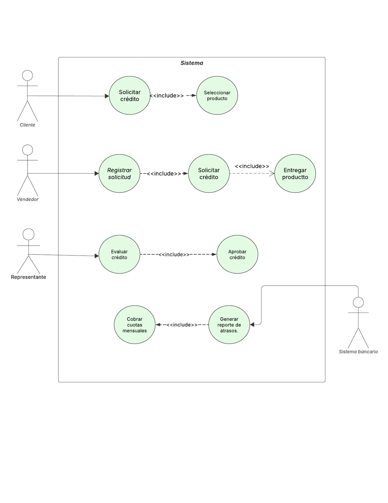
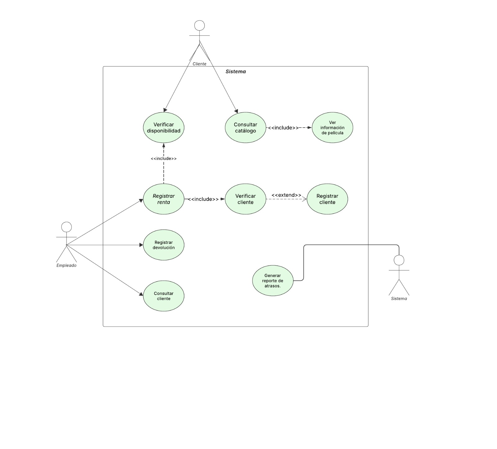
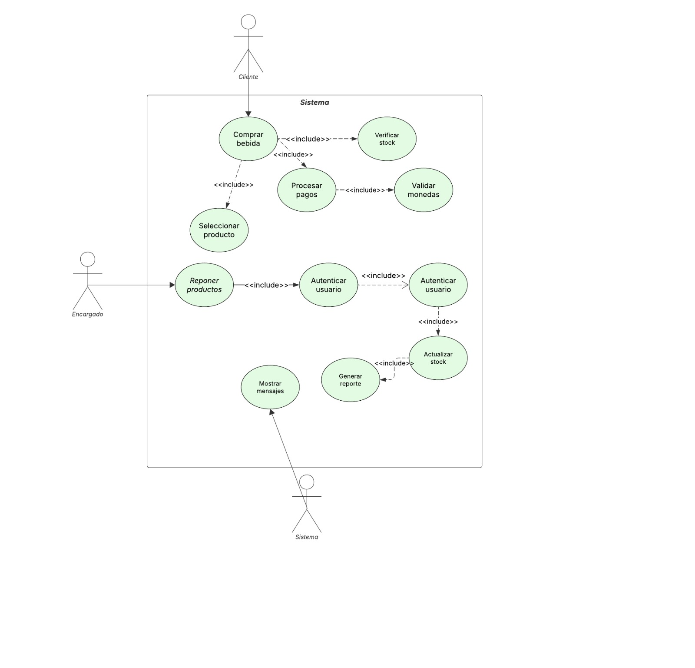

## Caso de uso: Gestionar proceso de crédito venta de electrodomésticos

| Elemento | Descripción |
|----------|-------------|
| ID | CU01 |
| Caso de uso | Gestionar proceso de crédito venta de electrodomésticos |
| Actores | Cliente, Vendedor, Representante de crédito, Sistema de pago automático |
| Propósito | Solicitud de crédito por el cliente hasta el pago automático de las cuotas |
| Descripción | 1. El Cliente solicita crédito al Vendedor al momento de la compra. 2. El Vendedor registra la solicitud de crédito. 3. El Representante de Crédito autoriza o rechaza la solicitud. 4. Si el crédito es aprobado, el Vendedor entrega el producto al Cliente. 5. El Sistema de Pago Automático cobra mensualmente las cuotas del crédito al Cliente. |
| Precondiciones | El cliente desea comprar un electrodoméstico. El sistema de registro de ventas y créditos está operativo. El representante de créditos tiene acceso al sistema de autorización. El cliente tiene una tarjeta de crédito válida para débito automático. |
| Postcondiciones | El cliente ha recibido el electrodoméstico. El crédito ha sido otorgado y registrado. El proceso de pago automático mensual está configurado. |
| Extensiones síncronas | Si el crédito es rechazado Si el cliente no está registrado Si la solicitud de crédito es cancelada por el vendedor o cliente Si el Sistema de Pago Automático falla en el cobro mensual |

## Caso de uso: Registrar renta de película

| Elemento | Descripción |
|----------|-------------|
| ID | BB-02 |
| Caso de uso | Registrar renta de película |
| Actores | Empleado |
| Propósito | Permitir registrar el préstamo de una película a un cliente |
| Descripción | 1. El sistema solicita al empleado ingresar el identificador del cliente. 2. El empleado ingresa los datos del cliente. 3. El sistema verifica si el cliente está registrado. 4. Si el cliente no existe, el sistema solicita los datos para su registro. 5. El empleado ingresa los datos del nuevo cliente. 6. El sistema registra al cliente en la base de datos. 7. El sistema muestra el catálogo de películas disponibles. 8. El empleado selecciona la película que el cliente desea rentar. 9. El sistema verifica la disponibilidad de la película. 10. El sistema muestra la información de la película seleccionada. 11. El empleado confirma la renta. 12. El sistema registra la renta asociando cliente, película y fecha. 13. El sistema actualiza el estado de disponibilidad de la película. 14. El sistema muestra un mensaje de confirmación de la renta realizada. 15. El sistema detecta la hora (9:00 a.m.). 16. Consulta clientes con devoluciones atrasadas. 17. Genera el listado. |
| Precondiciones | El sistema debe estar operativo El catálogo de películas debe existir El empleado debe haber iniciado sesión |
| Postcondiciones | La renta queda registrada en el sistema La película queda marcada como no disponible |
| Extensiones síncronas | En paso 3: si el cliente no está registrado → se ejecuta el registro de cliente En paso 9: si la película no está disponible → el sistema muestra mensaje de error y finaliza el proceso En paso 11: si el empleado cancela la operación |

## Caso de uso: Reponer artículos

| Elemento | Descripción |
|----------|-------------|
| ID | CU02 |
| Caso de uso | Reponer artículos |
| Actores | Encargado de reposición |
| Propósito | Permitir al encargado reponer el stock de productos y actualizar el sistema |
| Descripción | 1. El Encargado de Reposición accede a la pantalla de gestión con su contraseña. 2. El sistema autentica al encargado. 3. El sistema muestra la pantalla de reposición, indicando productos faltantes o bajos en stock. 4. El Encargado selecciona el producto a reponer. 5. El Encargado indica la cantidad repuesta. 6. El Encargado confirma la reposición. 7. El sistema actualiza el stock del producto inmediatamente. 8. El sistema emite un resumen de faltante en dos copias (constancia y factura). |
| Precondiciones | La máquina expendedora está operativa. El Encargado de Reposición tiene una contraseña válida. El sistema de gestión de stock está operativo. |
| Postcondiciones | El stock del producto repuesto se actualiza en el sistema. Se emiten dos copias del resumen de reposición. |
| Extensiones síncronas | Contraseña incorrecta → acceso denegado Error en ingreso de datos → solicitar nuevamente |

